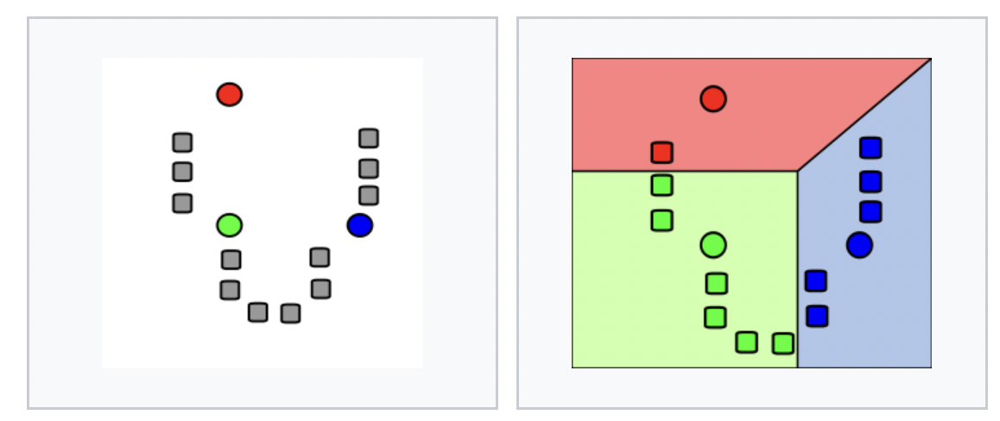
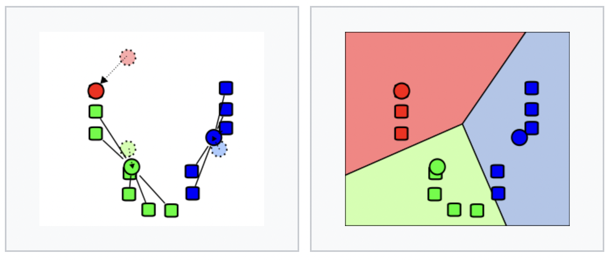

```{r setup, include=FALSE}

options(htmltools.dir.version = FALSE)

library(tidyverse)
library(tidymodels)
library(palmerpenguins)
library(ggplot2); theme_set(theme_minimal())
library(ranger)
library(kableExtra)
library(vip)

penguins <- penguins

```
---

# Workshop structure:

--

- We'll begin by going over the libraries needed to run the examples as these can take a while to install.

--

- An overview of why Tidymodels is such an exciting new meta-package, and also highlight some alternatives.

--

- Machine learning in a nutshell

--

- Introducing the 🐧Palmer penguins data 🐧!

--

- An example of unsupervised learning: k means clustering.

--

- An example of classification: Predicting the sex of the penguins using logistic regression and random forests.

---


class: inverse, center, middle

# Getting Started

---

### How to install the packages:

--

We'll be doing our machine learning using the [Tidymodels](https://www.tidymodels.org) environment.

You can install the **Tidymodels** package from CRAN:

```{r eval=FALSE, tidy=FALSE}
# install.packages("tidymodels")

library(tidymodels)
```

--

We'll also be using packages from the **Tidyverse** which we can also get from CRAN:

```{r eval=FALSE, tidy=FALSE}
# install.packages("tidyverse")

library(tidyverse)
```

--

We will also be using the ranger package to fit random forests, and the vip package for variable importance plots:

```{r eval=FALSE, tidy=FALSE}
library(ranger)
library(vip)
```

---
### How to load the data:

--

**First way:**  
--
<br>

- Using the [palmer penguins package](https://allisonhorst.github.io/palmerpenguins/).

```{r, eval = FALSE}
install.packages("palmerpenguins")

library(palmerpenguins)

penguins <- penguins

```

--

**Second way:**  
--
<br>

- Downloading it from the tidy Tuesday github page:

```{r, eval=FALSE}

url = "https://raw.githubusercontent.com/rfordatascience/tidytuesday/master/data/2020/2020-07-28/penguins.csv"

#penguins <- read_csv(url)

```

--
If you want to find out more about how to use Github check out Dr Rachel Ainsworth's [Pick N Mix session on using Github](https://vimeo.com/435771660)!

---
class: inverse, center, middle

# 🌰🌰Machine Learning in a nutshell 🌰🌰

---
# What is machine learning?

--

- An umbrella concept for computational techniques through which the discovery of patterns in data can be automated. The boundaries of this term are disputed and it is often used interchangeably with terms such as statistical learning, pattern recognition, AI, or even statistics.

--

- Two main types of algorithms: supervised, and unsupervised. We will be looking at both today.

--

- Supervised learning involves working with data where both dependent and independent variables are known. This includes tasks such as regression and classification.

--

- Unsupervised learning involves searching for patterns with data that is unlabeled. This includes tasks such as clustering and principal component analysis.

---
# Machine learning in R: What is tidymodels?

--

- Tidymodels is a meta-package (like the tidyverse!) developed by the RStudio team.

--

- "The tidymodels framework is a collection of packages for modelling and machine learning using tidyverse principles."

--

- Priority is on ease of use, consistency, and readable code (rather that speed).

--

- "Successor" to the widely used [caret package](http://topepo.github.io/caret/index.html), especially Parsnip.

--

- Emphasis is on predictive modelling (supervised learning).

--

- Still in development, and new packages are popping up fast.

---
# Some alternatives:

--

**Scikit-learn:**

--

- This is a Python library, and (probably?) the most used software for machine learning. Until Tidymodels came along I think this library gave Python the edge over R for easy machine learning.

--

- The [documentation](https://scikit-learn.org/stable/) is fantastic, worth checking out for a good intro to most machine learning topics!

--

**mlr3:**

--

- The other big machine learning library in R.

--

- Allows for some features not currently available in Tidymodels such as spatial cross-validation (more on that later)

---
class: inverse, center, middle

# 🐧🐧 Penguin time 🐧🐧

---

# The Palmer Penguins:


---


- Originally published in [Gorman KB, Williams TD, Fraser WR (2014). Ecological sexual dimorphism and environmental variability within a community of Antarctic penguins (genus Pygoscelis)](https://journals.plos.org/plosone/article?id=10.1371/journal.pone.0090081).  

--

- Bundled into the palmerpenguins R package by Dr. Kristen Gorman, Dr. Allison Horst, and Dr. Alison Hill as an alternative to libraries such as iris or mtcars. This contains a raw data set and a cleaned data set.

--

- Featured as the 31st [Tidy Tuesday](https://github.com/rfordatascience/tidytuesday/blob/master/data/2020/2020-07-28/readme.md) data set in 2020.

--

- You can find out more about the origins of this data set in [this post on the RStudio Education blog](https://education.rstudio.com/blog/2020/07/palmerpenguins-cran/). 
--

```{r}
names(penguins)
```

--

```{r}
names(penguins_raw)
```

---

- Let's begin by visualizing some of the variables in the data set:

--

```{r, tidy=FALSE, message = FALSE, fig.width = 17, fig.height = 8}
penguins %>%
  filter(!is.na(sex)) %>%
  ggplot(aes(flipper_length_mm, bill_length_mm,
             color = sex,
             size = body_mass_g)) +
  geom_point(alpha = 0.5) +
  facet_wrap(~species)
```

---
class: inverse, center, middle

# Clustering:

---
# K-Means clustering:

A popular method for clustering data is k-means clustering. 

--

This approach seeks to separate data in k clusters, where the within-cluster sum-of-squares is minimized: $\sum_{i=0}^{n}\min_{\mu_j \in C}(||x_i - \mu_j||^2)$

--

This is done in three steps:

--

- Step one: Choosing the initial centres, this is usually done randomly, though in some variants centres are deliberately set far away from each other (most prominently k-means++).

--

- Step two: Assign each point in the sample to its nearest centre.

--

- Step three: Calculate the mean value of all points assigned to every centre, this point is now the new centre for that cluster.

--

Step two and three are iterated until some stopping condition is met (typically when the difference between the current and new centres falls below a certain threshold).
---



---
# K-means in R:

- There are many approaches to fitting a k-means model, today we will be using the [kmeans()](https://www.rdocumentation.org/packages/stats/versions/3.6.2/topics/kmeans) function from the R Stats package (usually loaded as default). 

--

- This function uses an efficient version of the approach described above as presented in "Algorithm AS 136: A K-Means Clustering Algorithm" by [Hartigan, J. A., & Wong, M. A. (1979)]().

--

- More generally it is important to keep in mind that there is almost always a difference between statistical methods as understood theoretically by users, and how they are implemented computationally (an excellent example of this is [Matthew Drury's blogpost](http://madrury.github.io/jekyll/update/statistics/2016/07/20/lm-in-R.html) on how R fits linear regression models).

---

# Preprocessing:

This code creates a new tibble called penguins_scaled, which contains all the numeric variables from penguins other than the variable for year, and scales all the variables.
```{r, eval = FALSE}
penguins_scaled <- penguins %>%
  drop_na %>% 
  select(where(is.numeric),
         -year) %>% 
  mutate_at(colnames(.),
            ~(scale(.) %>% as.vector))
```

```{r, echo = FALSE}
penguins_scaled <- penguins %>%
  drop_na %>% 
  select(where(is.numeric),
         -year) %>% 
  mutate_at(colnames(.),
            ~(scale(.) %>% as.vector))

kable(head(penguins_scaled))
```

---

# Clustering and getting results:

--
K-means has an element of randomness so we need to set the random seed to ensure reproducibility:

```{r, eval=FALSE}
set.seed(1234)
```

--

First, we fit the k means clustering using the [kmeans function](). We can then extract the results and combine it with our data-frame with the [augment function]() from the broom package:

```{r, eval = FALSE}
k_clust <- penguins_scaled %>%
  kmeans(centers = 3) %>%
  augment(drop_na(penguins))
```


```{r, echo= FALSE}
set.seed(1234)

k_clust <- penguins_scaled %>%
  kmeans(centers = 3) %>%
  augment(drop_na(penguins))

kable(head(k_clust)) %>%
  kable_styling(font_size = 14,position = "center")

```

---

# Visualising results:

We can then visualize the clusters. 

```{r, fig.width = 14, fig.height = 5}
k_clust %>% 
  ggplot(aes(x = bill_length_mm, y = bill_depth_mm,
             colour = .cluster)) + 
  geom_point() +
  scale_colour_manual(values = c("darkorange","purple","cyan4"))
```

These look pretty similar to the species! Let's explore that further...
---

Here the color corresponds to the species of the penguin, and the number to the cluster assigned to it by our algorithm :

```{r, fig.width = 14, fig.height = 7}
k_clust %>% 
  ggplot(aes(x = bill_length_mm, y = bill_depth_mm,
             colour = species)) +   #<<
  geom_text(aes(label= .cluster)) + #<<
  scale_colour_manual(values = c("darkorange","purple","cyan4"))
```

---

We can get even closer using additional variables from the penguins_raw data-set:

```{r, echo = FALSE, fig.width = 14, fig.height = 10}
penguins_raw %>% 
  drop_na(where(is.numeric)) %>% 
  select(where(is.numeric),
         -`Sample Number`,
         -`Date Egg`) %>% 
  mutate_at(colnames(.),
            ~(scale(.) %>% as.vector))%>% 
  kmeans(centers = 3) %>% 
  augment(drop_na(penguins_raw,
                  where(is.numeric)))%>% 
  ggplot(aes(x = `Culmen Length (mm)`, y = `Culmen Depth (mm)`, colour = Species)) +
  geom_text(aes(label= .cluster)) +
  scale_colour_manual(values = c("darkorange","purple","cyan4"))
```

---
# Choosing the number of clusters:

First we can fit 9 different models with k = 1 to k = 9.

```{r}

# Setting the random seed:

set.seed(1234)

# Fitting the models:

kclusts <- 
  tibble(k = 1:9) %>%
  mutate(
    kclust = map(k, ~kmeans(penguins_scaled, .x)),
    tidied = map(kclust, tidy),
    glanced = map(kclust, glance),
    augmented = map(kclust, augment, penguins_scaled))
```

---

Then extract information on each model using broom:


```{r}
clusters <- 
  kclusts %>%
  unnest(cols = c(tidied))

assignments <- 
  kclusts %>% 
  unnest(cols = c(augmented))

clusterings <- 
  kclusts %>%
  unnest(cols = c(glanced))
```

---

As before we can look at the results using ggplot:

```{r, fig.width = 14}
ggplot(assignments, aes(x = bill_length_mm , y = bill_depth_mm)) +
  geom_point(aes(color = .cluster), alpha = 0.8) + 
  facet_wrap(~ k)
```

---

We can also draw an "elbow plot":

```{r, fig.width = 14}
ggplot(clusterings, aes(k, tot.withinss)) +
  geom_line() +
  geom_point()
```


---
class: inverse, center, middle

#Classification:

---
We're going to explore a simple classification task: predicting the sex of our penguins. This example is from Julia Silge's [tidy tuesday blogpost](https://juliasilge.com/blog/palmer-penguins/). 

The following diagram from [Kuhn and Johnson (2019)](https://bookdown.org/max/FES/resampling.html) illustrates the kind of workflow we will be doing:


--

---

# Preprocessing:

--

- First we are going to remove any penguins that have missing data for sex:

```{r, tidy=FALSE}
penguins_prep <- penguins %>%
  filter(!is.na(sex)) %>%
  select(-year, -island)
```

---

# Much ado about sampling:
--

- First we can split our data into a testing and training sets using the [rsample package](https://rsample.tidymodels.org):

--

```{r}
set.seed(123)

penguin_split <- initial_split(penguins_prep, strata = sex) #<<

penguin_train <- training(penguin_split)

penguin_test <- testing(penguin_split)

```

--
- We will also create bootstrap re-samples of our training data using the bootstraps function from the same package.

```{r}
set.seed(123)

penguin_boot <- bootstraps(penguin_train)
```
---
# Specifying the models:

--
- The [parsnip package](https://www.tidymodels.org/find/parsnip/) "provide[s] a tidy, unified interface to models that can be used to try a range of models without getting bogged down in the syntactical minutiae of the underlying packages".

--

- We will specify two simple models, a logistic regression model using glm (part of base r), and a random forest model from the [ranger package](https://github.com/imbs-hl/ranger):

```{r}
glm_spec <- logistic_reg() %>%
  set_engine("glm")

rf_spec <- rand_forest() %>%
  set_mode("classification") %>%
  set_engine("ranger")
```
--

- We can also create an empty workflow object at this stage:

```{r}
penguin_wf <- workflow() %>%
  add_formula(sex ~ .)
```

---

# Fitting the models:

We then add our models to the workflow, and fit them to *each* of the resamples.

--

- For the logistic regression model:

```{r, message = FALSE}

glm_rs <- penguin_wf %>%
  add_model(glm_spec) %>%
  fit_resamples(resamples = penguin_boot,
    control = control_resamples(save_pred = TRUE))

```

--

- For the random forest model:

```{r, message = FALSE}
rf_rs <- penguin_wf %>%
  add_model(rf_spec) %>%
  fit_resamples(
    resamples = penguin_boot,
    control = control_resamples(save_pred = TRUE))
```

---

# Evaluating performance:

We can then look at how our models have performed using the [collect_metrics](https://tune.tidymodels.org/reference/collect_predictions.html) function from the [tune package](https://tune.tidymodels.org/index.html):

--

- For the logistic regression model:

```{r, eval = FALSE}
collect_metrics(glm_rs)
```

```{r, echo = FALSE}
collect_metrics(glm_rs) %>%
  kable()
```

--

- For the random forest model:

```{r, eval = FALSE}
collect_metrics(rf_rs)
```

```{r, echo = FALSE}
collect_metrics(rf_rs) %>% 
  kable()
```

---

Let's take a closer look at the performance of the logistic regression model, we can easily obtain a confusion matrix as a tidy tibble by using the [conf_mat_resampled](https://tune.tidymodels.org/reference/conf_mat_resampled.html) function. This gives us teh *average* confusion matrix over our 25 bootstraps:

```{r, tidy= FALSE}
glm_rs %>%
  conf_mat_resampled() %>%
  kable()
```


---
We can also look at these results using a Receiver Operator Characteristic (ROC) curve:

```{r, fig.width = 14, fig.height = 5}
glm_rs %>%
  collect_predictions() %>%
  group_by(id) %>%
  roc_curve(sex, .pred_female) %>%
  ggplot(aes(1 - specificity, sensitivity, color = id)) +
  geom_abline(lty = 2, color = "gray80", size = 1.5) +
  geom_path(show.legend = FALSE, alpha = 0.6, size = 1.2) +
  coord_equal()
```

This is looking pretty good! But...
---

# Bringing back the test data:

--

We might be **over-fitting** the data! To check that our model will perform well on new data we have to see how it performs on our testing data.

--

We can do this easily using the [last_fit](https://tune.tidymodels.org/reference/last_fit.html) function, this takes the model which performs the best on our training data, and fits it to the test data:

```{r}
penguin_final <- penguin_wf %>%
  add_model(glm_spec) %>%
  last_fit(penguin_split)
```

---

As with our training data, we can use [collect_metrics](https://tune.tidymodels.org/reference/collect_predictions.html) and [collect_predictions](https://tune.tidymodels.org/reference/collect_predictions.html) to look at the performance of our model:

```{r}
collect_metrics(penguin_final) %>% kable()
```

```{r}

collect_predictions(penguin_final) %>%
  conf_mat(sex, .pred_class)

```

---

We can also create another ROC curve for our final fit:

```{r, fig.width = 14, fig.height = 5}
penguin_final %>%
  collect_predictions() %>%
  roc_curve(sex, .pred_female) %>%
  ggplot(aes(1 - specificity, sensitivity)) +
  geom_abline(lty = 2, color = "gray80", size = 1.5) +
  geom_path(show.legend = FALSE, alpha = 0.6, size = 1.2) +
  coord_equal()
```

---

We can use the [tidy function](https://broom.tidymodels.org/index.html) from the broom package to get the coefficients for our model:

```{r}
penguin_final$.workflow[[1]] %>%
  tidy(exponentiate = TRUE) %>% 
  kable()
```

---

We can make a variable importance plot using the [vip package](https://koalaverse.github.io/vip/index.html) to explore which variables have had the most impact on our model's decisions:

```{r, fig.height= 5, fig.width= 12}

penguin_final %>% 
  pluck(".workflow", 1) %>%   
  pull_workflow_fit() %>% 
  vip(num_features = 20)
```

---

# Further resources:

--

- ["Tidy Modeling with R"](https://www.tmwr.org) by Max Khun and Julia Silge.

--

- ["Supervised Machine Learning for Text Analysis in R"](https://smltar.com)  by Emil Hvitfeldt and Julia Silge.

--

- ["Interpretable Machine Learning: A Guide for Making Black Box Models Explainable"](https://christophm.github.io/interpretable-ml-book/) by Christoph Molnar.

--

- ["The Elements of Statistical Learning: Data Mining, Inference, and Prediction"](https://web.stanford.edu/~hastie/ElemStatLearn/) by Trevor Hastie, Robert Tibshirani, and Jerome H. Friedman.

--

- ["An Introduction to Statistical Learning: With Applications in R"](http://faculty.marshall.usc.edu/gareth-james/ISL/) by Gareth M. James, Daniela Witten, Trevor Hastie, and Robert Tibshirani.

--

- Julia Silge's blog. The classification part of this workshop in taken from [her blogpost about Palmer Penguins](https://juliasilge.com/blog/palmer-penguins/).

--

- The [fairmodels package](https://modeloriented.github.io/fairmodels/index.html)

---
# Credits:

--

- Alison Horst is the author/maintainer for the Palmer Penguin package, she is also responsible for the penguin illustrations I have used. You can find many other of her r-related illustrations [here](https://github.com/allisonhorst/stats-illustrations).

--

- Julia Silge is a research software engineer at R Studio and one of the developers of tidymodels.

--
---
class: inverse, center, middle

# Thanks!
